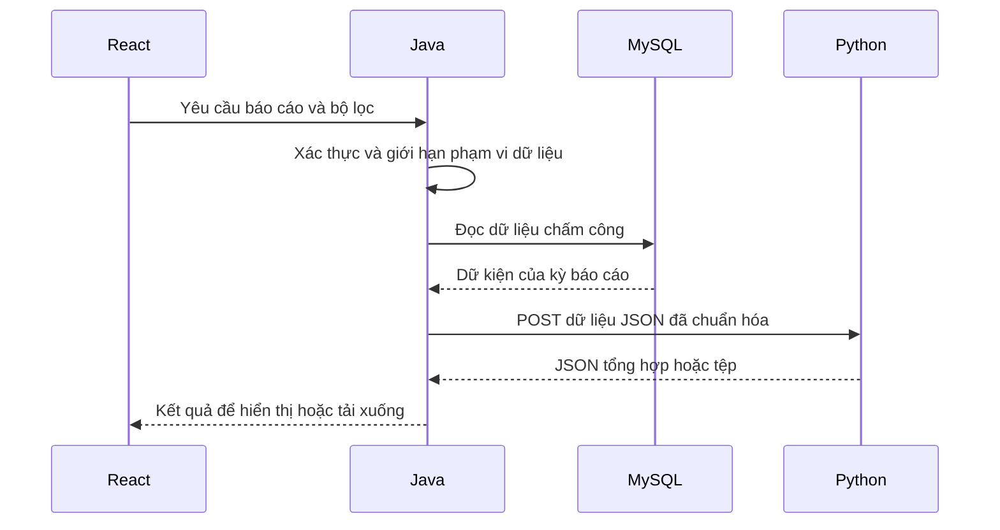

# Phân công Java và Python — Chấm Công LAN

Ngày soạn: 08/09/2026. Đây là phương án triển khai đề xuất, chưa phải mã nguồn đã chạy.

Dựa trên [README](https://github.com/nguyng/Cham_Cong_LAN/blob/master/README.md) và [phân tích dự án](https://github.com/nguyng/Cham_Cong_LAN/blob/master/phan_tich_du_an_cham_cong.md). Khi kiểm tra, nhánh `master` ở commit `67121a8cb55d6bb5ae831b3243c1af26938a3bc1` chỉ có tài liệu và cấu hình Git, chưa có backend/frontend để tách.

## 1. Phương án chung

Nhóm viết **Java + Spring Boot** cho backend chính. Bạn viết **Python + FastAPI** cho dịch vụ báo cáo và phân tích chấm công. Giao diện web dùng **React** như kế hoạch ban đầu.

Java và Python là hai chương trình chạy riêng, trao đổi JSON qua HTTP. Trình duyệt gọi Java; Java kiểm tra quyền, lấy dữ liệu và gọi Python khi cần báo cáo. MySQL do Java quản lý. Python nhận dữ liệu qua API và trả kết quả, nên bạn có thể phát triển bằng dữ liệu mẫu trước khi backend Java hoàn thành.

Đây là lựa chọn kiến trúc cho đồ án này. Phân công dựa trên tính độc lập của chức năng; Java và Python đều có thể thực hiện nhiều loại nghiệp vụ khác.

## 2. Phân chia chức năng

| Chức năng | Java / Spring Boot | Python / FastAPI | React |
| --- | --- | --- | --- |
| Đăng nhập, đăng xuất, phân quyền | Xác thực, JWT, vai trò Employee/Manager/Admin | Xác thực lời gọi nội bộ từ Java | Form đăng nhập, điều hướng theo vai trò |
| Nhân viên, phòng ban | API quản lý và lưu MySQL | Nhận thông tin cần cho báo cáo | Form, bảng quản lý |
| Ca làm, phân ca | Quản lý lịch, ca qua đêm, quy tắc tính công | Nhận dữ liệu đã tính theo quy tắc của Java | Giao diện phân ca |
| Chấm công vào/ra | Ghi giờ máy chủ, kiểm tra trạng thái và IP, lưu giao dịch | Không tham gia đường xử lý chấm công | Nút vào/ra, hiển thị kết quả |
| Đi muộn, về sớm, giờ làm | Tính số phút và công được ghi nhận theo chính sách đã thống nhất | Tổng hợp các giá trị Java gửi | Hiển thị trạng thái |
| Nghỉ phép | Tạo/duyệt đơn, số dư phép và dữ liệu lưu trữ | Tổng hợp dữ liệu nghỉ đã được Java xác nhận | Form xin nghỉ, danh sách duyệt |
| Random Check | Lập lịch, gửi yêu cầu, nhận xác nhận, ghi hết hạn | Thống kê kết quả để quản lý xem lại | Popup xác nhận, đếm ngược |
| Dashboard trực tiếp | WebSocket/STOMP, ai đang có mặt, cảnh báo quá hạn | Cung cấp thống kê khi được yêu cầu | Hiển thị và cập nhật màn hình |
| Báo cáo tổng hợp | Kiểm tra quyền, tạo bộ dữ liệu theo kỳ | Tổng hợp theo nhân viên, phòng ban, ngày/tháng | Bộ lọc, bảng báo cáo |
| Xuất Excel | Gửi dữ liệu và chuyển tệp về trình duyệt | Tạo workbook, định dạng và tổng hợp | Nút tải Excel |
| Xuất PDF | Gửi dữ liệu và chuyển tệp về trình duyệt | Tạo báo cáo in được, hỗ trợ tiếng Việt | Nút tải PDF |
| Phân tích bất thường | Cung cấp dữ kiện; lưu kết quả nếu nhóm cần lịch sử | Gắn cờ cần kiểm tra theo quy tắc rõ ràng | Danh sách để quản lý xem xét |
| Database, nhật ký, sao lưu | Java sở hữu schema; nhóm phụ trách triển khai vận hành backup | Không cần tài khoản MySQL trong bản đầu | Không truy cập database trực tiếp |

Java ghi nhận sự kiện Random Check không phản hồi thành trạng thái `MISSED`. Đề xuất để quản lý xem xét trước khi điều chỉnh công; cảnh báo của Python cũng là thông tin hỗ trợ kiểm tra, không tự kết luận gian lận.

## 3. Phân công nhóm 5 người

Đây là cách sắp xếp lại theo nhóm 5 người trong README; số thành viên dưới đây là nhãn phân công đề xuất.

| Người | Phần việc chính | Đầu ra bàn giao |
| --- | --- | --- |
| Thành viên 1 — Java | Đăng nhập, phân quyền, chấm công, IP LAN, Random Check, WebSocket | Backend nghiệp vụ chính và tài liệu API |
| Thành viên 2 — Java | Nhân viên, phòng ban, ca làm, nghỉ phép, schema MySQL, tích hợp Python | API quản lý, migration/SQL, dữ liệu mẫu, bộ gọi dịch vụ Python |
| Thành viên 3 — React | Đăng nhập, trang nhân viên, lịch sử, nghỉ phép, popup Random Check | Giao diện nhân viên kết nối API Java |
| Thành viên 4 — React | Admin, Manager, dashboard, báo cáo và tải file | Giao diện quản trị, thống kê |
| Bạn — Python | FastAPI, tổng hợp báo cáo, Excel/PDF, phân tích bất thường | Dịch vụ Python, schema JSON, ví dụ request/response, hướng dẫn chạy |

Thành viên 1 và 2 cùng chốt quy tắc tính công và thiết kế dữ liệu. Bạn và thành viên 2 chịu trách nhiệm ghép Java–Python. Mỗi người viết hướng dẫn chạy phần mình; cả nhóm cùng kiểm thử trên LAN.

## 4. Cách các phần kết hợp

Ví dụ khi quản lý yêu cầu báo cáo:



Chức năng chấm công vào/ra chỉ cần Java và MySQL. Việc gọi Python nằm trong các chức năng báo cáo/phân tích, giúp lỗi báo cáo không làm dừng chấm công.

Spring hỗ trợ gọi HTTP bằng các REST client, trong đó có `RestClient`; chọn client phù hợp với phiên bản Spring Framework của dự án. FastAPI có thể khai báo và kiểm tra JSON đầu vào bằng Pydantic. Tham khảo [Spring REST Clients](https://docs.spring.io/spring-framework/reference/6.2/integration/rest-clients.html) và [FastAPI Request Body](https://fastapi.tiangolo.com/tutorial/body/).

## 5. API cần thống nhất

Các endpoint dưới đây là thiết kế đề xuất, chưa tồn tại trong repository tại thời điểm kiểm tra. `/api/v1` là API Java phục vụ giao diện; `/internal/v1` là API Python phục vụ Java.

### 5.1 Các nhóm API Java

| Nhóm | Endpoint ví dụ | Chủ sở hữu |
| --- | --- | --- |
| Xác thực | `POST /api/v1/auth/login`, `GET /api/v1/auth/me` | Thành viên 1 |
| Chấm công | `POST /api/v1/attendance/check-in`, `POST /api/v1/attendance/check-out` | Thành viên 1 |
| Lịch sử | `GET /api/v1/attendance/mine` | Thành viên 1 |
| Nhân sự | `GET /api/v1/employees`, `POST /api/v1/employees` | Thành viên 2 |
| Phòng ban, ca làm | `/api/v1/departments`, `/api/v1/shifts`, `/api/v1/shift-assignments` | Thành viên 2 |
| Nghỉ phép | `POST /api/v1/leave-requests`, `PATCH /api/v1/leave-requests/{id}/decision` | Thành viên 2 |
| Random Check | `GET /api/v1/random-checks/mine`, `POST /api/v1/random-checks/{id}/confirm` | Thành viên 1 |
| Báo cáo | Các endpoint ở bảng tích hợp bên dưới | Thành viên 2 phối hợp với bạn |

Đây là danh mục định hướng, không phải số lượng API Java đầy đủ. Nhóm bổ sung thao tác xem/sửa/khóa và bộ lọc theo yêu cầu từng màn hình.

### 5.2 Bốn API nghiệp vụ Python

| Java cung cấp cho React | Java gọi Python | Kết quả Python |
| --- | --- | --- |
| `GET /api/v1/reports/summary` | `POST /internal/v1/reports/summary` | JSON tổng hợp công, phút làm, phút muộn/sớm |
| `GET /api/v1/reports/export?format=xlsx` | `POST /internal/v1/reports/export/xlsx` | Tệp `.xlsx` |
| `GET /api/v1/reports/export?format=pdf` | `POST /internal/v1/reports/export/pdf` | Tệp `.pdf` |
| `GET /api/v1/reports/anomalies` | `POST /internal/v1/reports/anomalies` | JSON danh sách cần kiểm tra |

Bộ lọc công khai: `from`, `to`, `departmentId` và `employeeId` khi cần. Khoảng thời gian được hiểu bao gồm cả hai ngày; bản đầu giới hạn tối đa 31 ngày/lần. Java xác thực phạm vi trước khi đọc dữ liệu: Employee chỉ xem mình; Manager chỉ xem bộ phận được phân công; Admin theo quyền được cấp. Một ID do trình duyệt gửi không tự tạo ra quyền truy cập ID đó.

Hai lựa chọn `format=xlsx` và `format=pdf` dùng cùng endpoint Java với tham số khác nhau. Python có 4 endpoint nghiệp vụ kể trên; `GET /health` là một endpoint kỹ thuật bổ sung. Mỗi lời gọi Python nhận đầy đủ dữ liệu đã được lọc, không tự truy vấn ngược Java hoặc MySQL.

Excel có thể tạo bằng [openpyxl](https://openpyxl.readthedocs.io/en/stable/tutorial.html); PDF có thể tạo bằng ReportLab, kèm font TrueType hỗ trợ tiếng Việt theo [hướng dẫn font](https://docs.reportlab.com/reportlab/userguide/ch3_fonts/). FastAPI hỗ trợ trả tệp hoặc luồng dữ liệu theo [Custom Response](https://fastapi.tiangolo.com/advanced/custom-response/).

### 5.3 Dữ liệu JSON Java gửi cho Python

Bốn endpoint Python dùng cùng một kiểu dữ liệu đầu vào. Ví dụ dưới đây chỉ minh họa một nhân viên trong một ngày bằng dữ liệu giả:

```json
{
  "schemaVersion": "1.0",
  "requestId": "report-demo-001",
  "fromDate": "2026-08-03",
  "toDate": "2026-08-03",
  "timezone": "Asia/Ho_Chi_Minh",
  "asOf": "2026-08-04T08:00:00+07:00",
  "dailyFacts": [
    {
      "employeeId": 101,
      "employeeCode": "NV001",
      "employeeName": "Nhân viên mẫu",
      "departmentId": 10,
      "departmentName": "Kỹ thuật",
      "workDate": "2026-08-03",
      "attendanceState": "FINALIZED",
      "plannedMinutes": 480,
      "workedMinutes": 480,
      "lateMinutes": 0,
      "earlyLeaveMinutes": 0,
      "creditedDayUnits": "1.0000",
      "randomCheckMissedCount": 0,
      "reviewFlags": []
    }
  ]
}
```

Các quy ước để hai người code độc lập:

| Quy ước | Cách thực hiện |
| --- | --- |
| Tên trường | Dùng đúng tên camelCase ở trên; Python khai báo Pydantic theo tên đó hoặc dùng alias |
| ID | ID do Java cấp; Python không tự tạo lại mã nhân viên/phòng ban |
| Đơn vị dữ liệu | Một dòng cho một nhân viên trong một ngày công; khóa duy nhất `(employeeId, workDate)` |
| Nhiều ca trong ngày | Java tổng hợp các ca trước khi gửi; Python không đếm mỗi ca thành một ngày công |
| Ngày công | Ca qua đêm thuộc ngày bắt đầu ca, trừ khi nhóm thống nhất quy tắc khác và cập nhật hợp đồng |
| Thời gian | Thời điểm có múi giờ/offset; Java chuẩn hóa về ngày công `Asia/Ho_Chi_Minh` |
| Số phút | Số nguyên không âm; Java tính thời gian nghỉ, đi muộn, về sớm và giờ làm được công nhận |
| Công được ghi nhận | Java tính `creditedDayUnits` theo chính sách nhóm chốt; truyền chuỗi thập phân và Python cộng bằng `Decimal` |
| Trạng thái | `FINALIZED`: đã chốt; `PENDING`: ca còn mở; `REVIEW_REQUIRED`: dữ kiện cần xử lý |
| Dữ liệu chưa chốt | `workedMinutes` và `creditedDayUnits` có thể là `null`; Python thống kê riêng số ngày chưa chốt, không coi `null` là 0 |
| Ngày không có lượt chấm | Java đối chiếu lịch phân ca/nghỉ phép để tạo dòng thích hợp; Python không suy ra vắng mặt từ một dòng bị thiếu |
| Dữ liệu gửi sang | Chỉ thông tin cần cho báo cáo, không có mật khẩu hoặc JWT người dùng |
| Phiên bản | Khi đổi schema, sửa ví dụ và hợp đồng dùng chung trước khi ghép code |

Java cần gửi đủ các ngày có lịch phân ca hoặc hoạt động thực tế trong phạm vi báo cáo và loại các ngày tương lai chưa bắt đầu. Java cũng xác nhận bộ dữ liệu là đầy đủ tại thời điểm `asOf`; Python không có dữ liệu ngoài request để tự kiểm tra thiếu dòng.

Kết quả minh họa từ `/internal/v1/reports/summary`:

```json
{
  "schemaVersion": "1.0",
  "requestId": "report-demo-001",
  "fromDate": "2026-08-03",
  "toDate": "2026-08-03",
  "asOf": "2026-08-04T08:00:00+07:00",
  "complete": true,
  "employees": [
    {
      "employeeId": 101,
      "employeeCode": "NV001",
      "employeeName": "Nhân viên mẫu",
      "departmentId": 10,
      "departmentName": "Kỹ thuật",
      "confirmedWorkedMinutes": 480,
      "confirmedLateMinutes": 0,
      "confirmedEarlyLeaveMinutes": 0,
      "confirmedDayUnits": "1.0000",
      "pendingDays": 0,
      "randomCheckMissedCount": 0
    }
  ]
}
```

Các tổng có tiền tố `confirmed` chỉ cộng dòng `FINALIZED` có dữ liệu hợp lệ. `pendingDays` đếm các dòng `PENDING` và `REVIEW_REQUIRED`; có bất kỳ dòng nào như vậy thì `complete=false`. Số Random Check không phản hồi được cộng riêng như một thông tin theo dõi, không tự động trừ vào tổng công. `complete` chỉ phản ánh việc chốt dữ kiện đã gửi tại `asOf`, không có nghĩa cả tháng đang diễn ra đã kết thúc.

Xuất Excel/PDF phải dùng cùng hàm tổng hợp với API summary. Nếu có dữ liệu chưa chốt, tệp ghi rõ trạng thái tạm tính và số ngày cần xử lý. Báo cáo là dữ liệu hỗ trợ tính lương, không chứa công thức lương tự suy đoán.

Endpoint anomalies trả `requestId` và danh sách gồm `employeeId`, `workDate`, `code`, `message`. Bản đầu tổng hợp `reviewFlags`, ngày `REVIEW_REQUIRED`, và `randomCheckMissedCount > 0`. Ví dụ mã `MISSING_CHECK_OUT`, `RANDOM_CHECK_MISSED`; Java phải cung cấp đủ dữ kiện hoặc cờ tương ứng. Các thuật toán đánh giá xu hướng nhiều ngày chỉ thêm khi đã thống nhất quy tắc và dữ liệu đầu vào.

### 5.4 Hành vi lỗi và trả file

| Tình huống | Cách xử lý đề xuất |
| --- | --- |
| Người dùng chưa đăng nhập / không có quyền | Java trả 401 / 403 và dừng trước khi gọi Python |
| Bộ lọc người dùng sai | Java trả 400 với thông báo rõ trường cần sửa |
| Java không kết nối được Python | API báo cáo trả 503; chấm công tiếp tục hoạt động |
| Python xử lý quá thời hạn | Java trả 504 cho yêu cầu báo cáo |
| Schema Java gửi không hợp lệ | Python trả 422; Java ghi lỗi tích hợp theo `requestId` và trả 502 cho giao diện |
| Python trả JSON/tệp lỗi | Java trả 502; không gửi tệp hỏng như một kết quả thành công |
| Không có dữ liệu trong phạm vi hợp lệ | Summary trả danh sách rỗng; file thể hiện “Không có dữ liệu” |

Đặt timeout kết nối và xử lý có cấu hình; có thể bắt đầu thử với 2 giây kết nối và 30 giây xử lý, sau đó điều chỉnh theo phép đo thực tế. Giới hạn số tác vụ xuất báo cáo đang chạy để bảo vệ tài nguyên phục vụ chấm công; bản đầu không cần thêm hàng đợi phân tán.

JSON dùng UTF-8. Excel trả MIME `application/vnd.openxmlformats-officedocument.spreadsheetml.sheet`; PDF trả `application/pdf`. Java chuyển nội dung tệp và đặt `Content-Disposition: attachment` với tên tệp do server tạo. Chuỗi người dùng trong Excel được ghi như văn bản, không được biến thành công thức bảng tính.

## 6. Thư mục riêng trong cùng repository

Đây là cấu trúc đề xuất để tạo khi bắt đầu viết mã:

| Đường dẫn | Nội dung | Người phụ trách |
| --- | --- | --- |
| `backend-java/` | Project Maven, Java, cấu hình Spring Boot | Hai thành viên Java |
| `backend-java/.../report/` | `ReportController`, `ReportDatasetService`, `PythonReportClient`, DTO | Thành viên 2 phối hợp với bạn |
| `service-python/app/main.py` | Khởi tạo FastAPI và router | Bạn |
| `service-python/app/schemas/` | Pydantic request/response | Bạn |
| `service-python/app/routers/reports.py` | Bốn endpoint Python | Bạn |
| `service-python/app/services/` | Tổng hợp, Excel, PDF, phân tích cờ bất thường | Bạn |
| `service-python/requirements.txt` | Các phiên bản thư viện Python đã kiểm tra tương thích | Bạn |
| `frontend/` | React/Vite, gọi API Java và WebSocket | Hai thành viên React |
| `contracts/` | Schema JSON, request/response mẫu, quy ước lỗi | Bạn và thành viên 2 |
| `database/` | ERD, migration hoặc SQL, dữ liệu mẫu giả | Thành viên 2 |
| `docs/` | Hướng dẫn chạy từng phần và ghép LAN | Cả nhóm |

Hai phần Java/Python có môi trường chạy và dependency riêng. Mỗi chức năng dùng nhánh làm việc riêng, cập nhật hợp đồng API trước khi đổi dữ liệu trao đổi. Với cách đặt tên `backend-java/`, cần cập nhật lệnh `cd backend` trong README khi khởi tạo project thực tế.

## 7. Chạy trên LAN

Bản đầu đặt Java, Python và MySQL trên cùng một máy chủ để dễ demo. Cổng dưới đây là cấu hình đề xuất:

| Thành phần | Địa chỉ/cổng | Ai kết nối |
| --- | --- | --- |
| Java phục vụ API và React đã build | Địa chỉ LAN của máy chủ, cổng `8080` | Trình duyệt nhân viên/quản lý |
| Python FastAPI | `127.0.0.1:8000` | Java trên cùng máy chủ |
| MySQL | `127.0.0.1:3306` | Java trên cùng máy chủ |
| Vite khi phát triển | Cổng `5173`, proxy `/api` và đường dẫn WebSocket sang Java | Máy phát triển |

Đặt `PYTHON_SERVICE_URL=http://127.0.0.1:8000` trong cấu hình Java. Hai dịch vụ dùng một bí mật nội bộ từ môi trường, truyền qua header `X-Service-Key`; Python kiểm tra header trước khi xử lý. Bí mật không nằm trong mã React và không đưa lên Git. Cách gọi này không yêu cầu Python triển khai lại hệ thống đăng nhập người dùng.

Sau khi có mã Python và cài dependencies, chạy từ `service-python/` bằng lệnh `python -m uvicorn app.main:app --host 127.0.0.1 --port 8000`. Cú pháp chạy ASGI/Uvicorn được mô tả trong [FastAPI — Run a Server Manually](https://fastapi.tiangolo.com/deployment/manually/). Lệnh này là hướng dẫn cho mã sẽ triển khai, chưa chạy được chỉ từ tài liệu hiện có.

Trong quá trình phát triển trên hai máy khác nhau, cấu hình địa chỉ Python bằng IP LAN thực tế và giới hạn quyền kết nối tới dịch vụ. `127.0.0.1` luôn chỉ máy đang chạy chương trình, không trỏ sang máy đồng đội. Khi ghép bản demo lên một máy, quay về cấu hình loopback ở bảng trên. Nếu thêm container sau này, phải dùng tên dịch vụ/container theo mạng đã cấu hình, không dùng loopback để gọi container khác.

Cấu hình IP LAN được phép chấm công ở Java theo mạng thực tế. Trong cấu hình Java nhận kết nối trực tiếp, dùng IP kết nối mà server quan sát; nếu có reverse proxy sau này thì cấu hình nguồn proxy tin cậy trước khi dùng header chuyển tiếp.

Để demo không cần Internet, cài dependency và build trước; đóng gói Java, thư viện Python, React và font cần dùng. Giao diện phục vụ tài nguyên cục bộ. Nếu cần dùng trang Swagger UI khi offline thì cấu hình tài nguyên của trang đó tại máy chủ hoặc dùng công cụ gọi HTTP cục bộ để thử API.

## 8. Thứ tự triển khai và kiểm tra tích hợp

| Bước | Công việc | Điều kiện hoàn thành |
| --- | --- | --- |
| 1 | Bạn và thành viên 2 thống nhất JSON, quyền truy cập và quy tắc tính công | Có request/response mẫu và schema chung |
| 2 | Bạn viết summary và Excel bằng dữ liệu giả; Java làm xác thực/chấm công/schema | Hai bên chạy độc lập phần mình |
| 3 | Java viết bộ tạo dữ liệu và `PythonReportClient` | Gọi được summary/Excel từ Java |
| 4 | React kết nối trang báo cáo và nút tải | Người dùng thao tác trọn luồng qua Java |
| 5 | Bạn thêm PDF và bảng bất thường | JSON và hai định dạng file dùng cùng số liệu |
| 6 | Ghép dịch vụ lên máy chủ và thử bằng máy khác trong LAN | Chấm công, phân quyền, báo cáo hoạt động theo phạm vi |

Các tình huống cần kiểm tra khi đã có mã: hai nhân viên khác phòng; Manager yêu cầu báo cáo phòng không được phép; ca qua đêm; nhiều ca trong ngày; thiếu giờ ra; xin nghỉ đã duyệt; dòng trùng nhân viên/ngày; kỳ có dữ liệu chưa chốt; Python dừng hoặc timeout; Excel/PDF có tên tiếng Việt. Đối chiếu số phút và công giữa màn hình, JSON, Excel và PDF từ cùng bộ dữ liệu.

Tài liệu này mới kiểm tra thiết kế và ví dụ JSON; chưa xác nhận build, chạy dịch vụ hay kiểm thử mạng LAN vì repository chưa có mã triển khai.

## 9. Phần mở rộng về lập trình mạng

Tài liệu gốc có mục tự tìm server và TCP/UDP. Bản cơ bản dùng HTTP/WebSocket trong LAN với địa chỉ máy chủ được cấu hình. Nếu yêu cầu môn học bắt buộc tự viết UDP discovery, có thể phân thêm cho bạn một tiện ích Python tìm server và mở địa chỉ web; phía Java cung cấp bộ nhận/trả lời gói UDP tương ứng. Nhóm cần đặc tả riêng gói tin, cổng và timeout cho phần này; đây là một công việc bổ sung, không nằm trong 4 API báo cáo Python.

